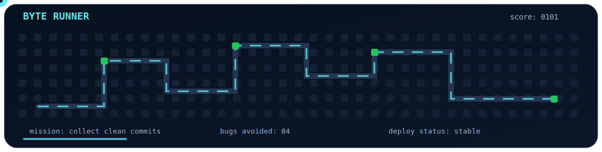

<div align="center">


<br>

<a href="https://portafolio-personal-edwin-sanchez.vercel.app">
  
</a>
<a href="https://www.linkedin.com/in/edwin-andr%C3%A9s-s%C3%A1nchez-orozco-aa4b40411">
  
</a>
<a href="https://github.com/AndresSanchez12323">
  
</a>

</div>

---

## `perfil.dev`

```txt
booting profile...

user        Edwin Andres Sanchez Orozco
role        Software Developer in training
career      Computer Engineering
focus       clean code, useful products, practical problem solving
stack       web, APIs, databases, scripting, Linux, Docker
status      building stronger projects one commit at a time

profile loaded successfully.
```

## Mini game: Byte Runner

<div align="center">
  
</div>

> A small visual game made for this profile: the runner moves through a circuit board, collects bits and keeps the build alive.

---

## Sobre mi

Soy estudiante de octavo semestre de Ingenieria en Informatica. Me gusta construir soluciones que se entiendan, funcionen bien y puedan mantenerse con el tiempo.

Me interesan especialmente el desarrollo de software, la logica de programacion, las APIs, las bases de datos, la automatizacion y los fundamentos de sistemas. Estoy en una etapa de crecimiento constante: aprender, construir, corregir y volver a mejorar.

---

## Stack de trabajo

<div align="center">

### Lenguajes


### Web, datos y herramientas


</div>

---

## Proyectos destacados

| Proyecto | Que resuelve | Tecnologias |
| --- | --- | --- |
| [Portfolio personal](https://portafolio-personal-edwin-sanchez.vercel.app) | Presentacion profesional bilingue con GitHub API, certificados, galeria y responsive completo. | HTML, CSS, JavaScript, Vercel |
| [VialServi](https://github.com/AndresSanchez12323/vial_servi) | Aplicacion orientada a gestion de seguros viales. | Web, logica de negocio |
| [Pro Connect](https://github.com/AndresSanchez12323/Pro-Connect) | Experiencia digital para conectar usuarios y organizar interaccion. | Frontend, backend |
| [Pokemon API](https://github.com/AndresSanchez12323/Pokemon-API) | Consumo y visualizacion de datos desde una API externa. | JavaScript, API |
| [Red social poliglota](https://github.com/AndresSanchez12323/Poliglota-Red-Social-Postgres-SQL-Neo4j) | Exploracion de persistencia poliglota usando base relacional y grafo. | PostgreSQL, Neo4j |

---

## Ruta de aprendizaje

```txt
2026  arquitectura, documentacion, despliegues y calidad visual
2025  compresion, bases de datos poliglotas, Assembly y Python
2024  primera aplicacion completa: VialServi
2023  logica, Java, Python, scripting y fundamentos
2022  inicio formal en desarrollo de software
```

---

## Actividad

<div align="center">
  <a href="https://github.com/AndresSanchez12323">
    
  </a>
  <br><br>
  <a href="https://github.com/AndresSanchez12323">
    
  </a>
</div>

---

## Ahora mismo estoy

- Mejorando mi portfolio y mi presentacion profesional.
- Construyendo proyectos con estructura, documentacion y buenas practicas.
- Practicando APIs, bases de datos, despliegues y automatizacion.
- Reforzando fundamentos de sistemas, algoritmos y programacion de bajo nivel.

---

<div align="center">

### Conectemos

<a href="https://portafolio-personal-edwin-sanchez.vercel.app">Portfolio</a>
·
<a href="https://www.linkedin.com/in/edwin-andr%C3%A9s-s%C3%A1nchez-orozco-aa4b40411">LinkedIn</a>
·
<a href="https://github.com/AndresSanchez12323">GitHub</a>

<br><br>

<sub>Codigo claro. Soluciones utiles. Mejoras constantes.</sub>

</div>
