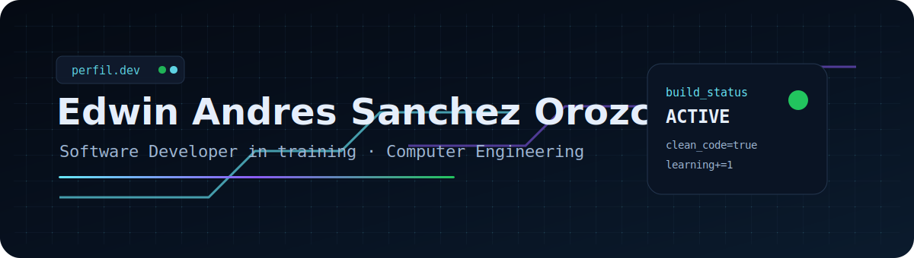

<div align="center">



<br>

<a href="https://portafolio-personal-edwin-sanchez.vercel.app">
  
</a>
<a href="https://www.linkedin.com/in/edwin-andr%C3%A9s-s%C3%A1nchez-orozco-aa4b40411">
  
</a>
<a href="https://github.com/AndresSanchez12323">
  
</a>

</div>

---

## `perfil.dev`

```txt
booting profile...

user        Edwin Andres Sanchez Orozco
role        Software Developer in training
career      Computer Engineering
focus       clean code, useful products, practical problem solving
stack       web, APIs, databases, scripting, Linux, Docker
status      building stronger projects one commit at a time

profile loaded successfully.
